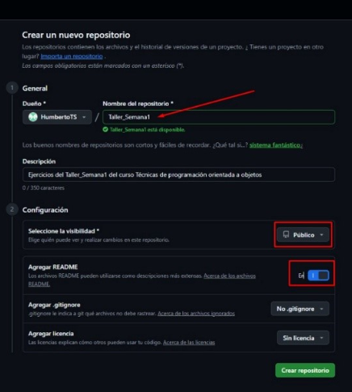
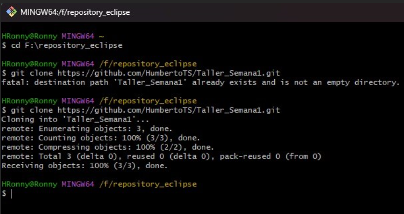
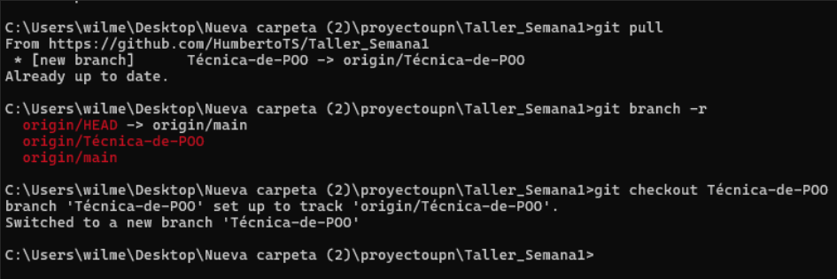
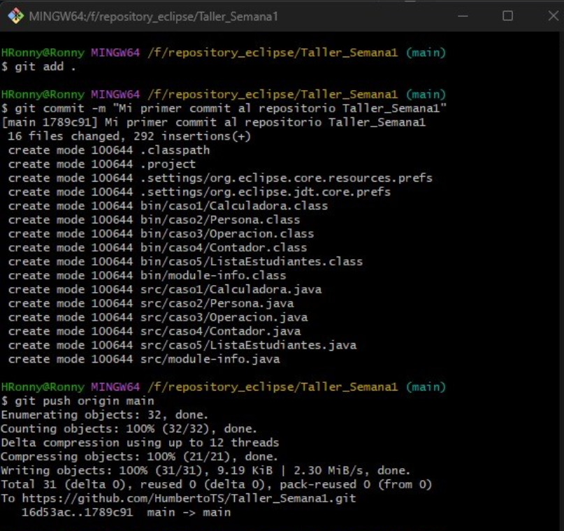
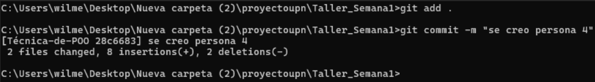
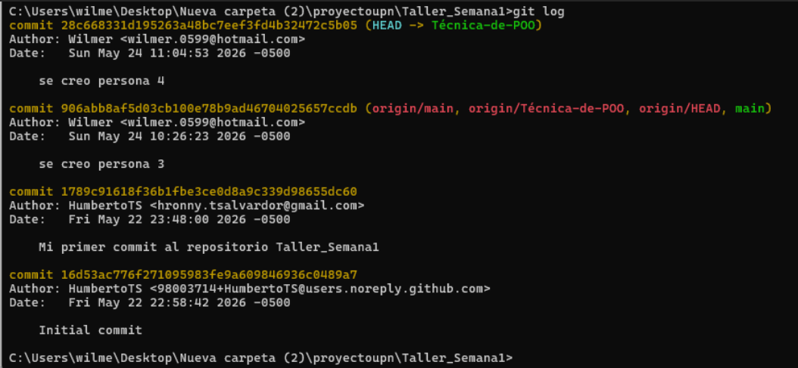
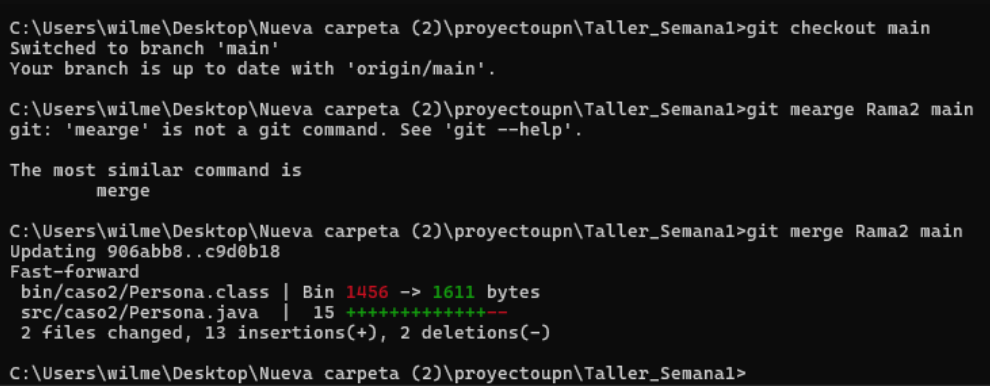
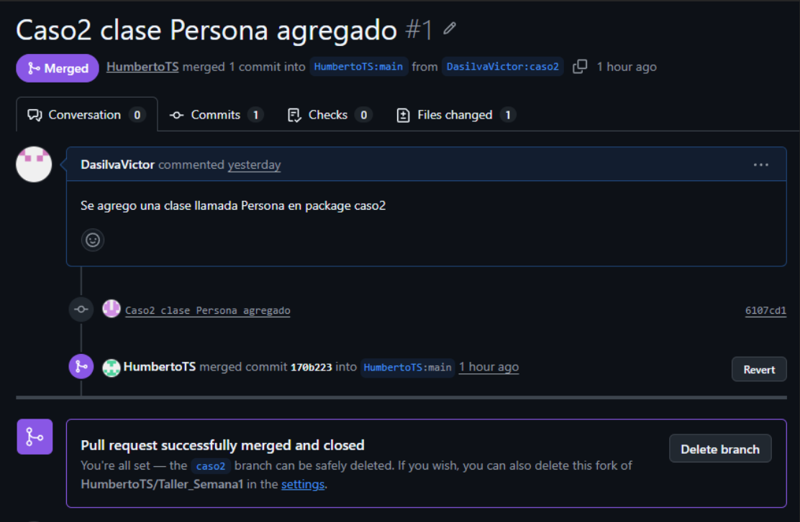

# FACULTAD DE INGENIERÍA
## CARRERA DE INGENIERÍA EN SISTEMAS COMPUTACIONALES

**CURSO:** PROGRAMACIÓN ORIENTADA A OBJETOS

**PRACTICA DE CAMPO 1 Y 2**

**INTEGRANTES:**
- VICTOR HUGO CHIRINOS GALDINO DA SILVA – N00538398
- CLAUDIA ARACELY MIRANDA OYOLA         – N00333647
- JORGE EDUARDO QUISPE ESPINOSA         – N00536756
- HUMBERTO RONNY TIQUILLAHUANCA         – N00428614

**DOCENTE:** MARTIN EDUARDO TORRES RODRIGUEZ

**Lima, 24 de mayo del 2026**

---

## Guía documentada de Git y GitHub

### Crear Repositorio GitHub

### Clonar un repositorio de GitHub

En la siguiente imagen se está utilizando el comando `git clone` para crear una copia exacta del repositorio remoto "Taller_Semana1" en la máquina local.

### Navegación básica por el repositorio

En la siguiente imagen primero se hace un `git pull` para descargar todos los cambios más recientes del repositorio remoto en la máquina local. Luego, para verificar qué ramas existen en el repositorio, ejecutamos el comando `git branch -r`. Finalmente, para dirigirnos a la rama "Tecnica-de-POO", usamos el comando `git checkout Tecnica-de-POO`.

### Primer commit

### Realizar cambios en el código: usar `git add` y `git commit`

### Visualizar historial de commits

En esta parte se muestra el historial de commits realizados en el repositorio mediante el comando `git log`. Gracias a este comando se puede observar cada cambio realizado en el proyecto, incluyendo el nombre del autor, la fecha y el mensaje de cada commit. Esto ayuda a llevar un mejor control del avance del trabajo y permite identificar las modificaciones hechas durante el desarrollo del proyecto.

### Manejo de branches y merges

En esta sección se evidencia el uso de ramas (branches) para trabajar de manera organizada dentro del repositorio. Se utilizó el comando `git checkout` para cambiar entre ramas y posteriormente `git merge` para unir los cambios realizados hacia la rama principal `main`. Este procedimiento permite que varios integrantes puedan trabajar en diferentes partes del proyecto sin afectar directamente el código principal.

### Manejo de branches y merges (Pull Request)

En la siguiente imagen se observa el merge y la resolución de un pull request.

